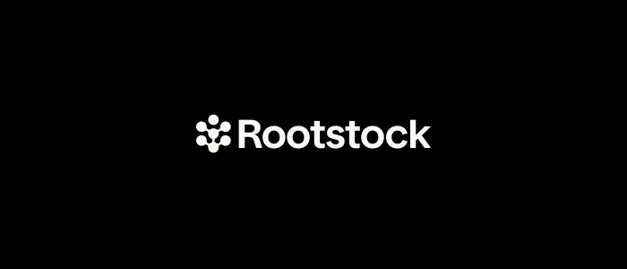

## Rootstock Wagmi & Shadcn Starter Kit

This starter kit provides a foundation for building decentralized applications (dApps) on the Rootstock blockchain using [React](https://react.dev/learn), [Wagmi](https://wagmi.sh/) and [Shadcn](https://ui.shadcn.com/) libraries. It includes features such as:

- Integration with [Rainbowkit](https://www.rainbowkit.com/) for wallet connection and interacting with smart contracts
- Sample integrations of interactions with tokens like ERC20, ERC721, and ERC1155.
- Prettier and eslint configured for project files.
- Tailwindcss and Shadcn configured for style customization.

Check the live demo here: https://rsk-wagmi-starter-kit.vercel.app/

## Project Structure

```text
.
├── public
├── src
│   ├── App.tsx
│   ├── assets
│   ├── components
│   ├── config
│   │   ├── providers.tsx
│   │   ├── rainbowkitConfig.ts
│   │   └── wagmiProviderConfig.ts
│   ├── lib
│   │   └── utils
│   ├── main.tsx
│   ├── pages
├── package.json
```

## Supported Networks

- Rootstock Mainnet
- Rootstock Testnet

## Usage

### Setup

#### 1. Clone Repository

```shell
git clone https://github.com/chrisarevalodev/rsk-wagmi-starter-kit.git
cd rsk-wagmi-starter-kit
```

#### 2. Install Dependencies

> **Note**: We recommend using yarn package manager given that there are some conflicts when installing some packages with npm.

```shell
yarn
```

#### 3. Run Project

```shell
yarn dev
```
